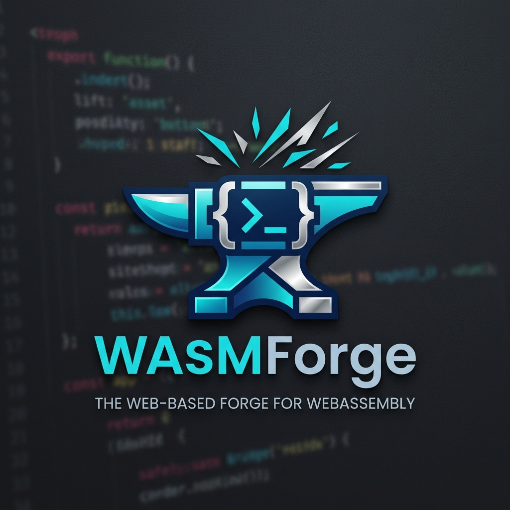
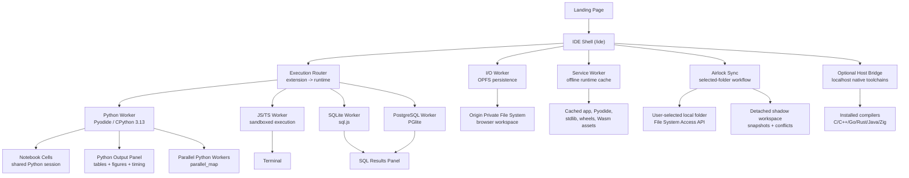

<div align="center">
  

  # WasmForge

  **Code past the internet.**

  A local-first browser IDE and Python notebook that keeps running after Airplane Mode, hard refreshes, and local-only project changes.

  [](https://wasm-forge.vercel.app/)
  [](https://gehu.in/hack)
  

</div>

WasmForge is a browser-first development environment where Python, Python notebooks, JavaScript, TypeScript, SQLite, and PostgreSQL run on the user's own machine through WebAssembly and Web Workers.

The core runtime has no execution backend. After the first warm load, the IDE can reload and run from local cache without network access.

For workflows that need a real project folder, WasmForge also includes **Airlock Sync**: a permission-gated bridge to a user-selected local folder with detached editing, snapshots, and conflict resolution. For native compilers, an optional localhost Host Bridge can run installed toolchains without adding a cloud backend.

**Live demo:** [https://wasm-forge.vercel.app/](https://wasm-forge.vercel.app/)

**IDE route:** [https://wasm-forge.vercel.app/ide](https://wasm-forge.vercel.app/ide)

---

## Why This Exists

Most web IDEs are remote compute with a browser UI. They look local, but code execution, persistence, and recovery still depend on someone else's server.

WasmForge takes the opposite bet:

- run supported runtimes in the browser
- keep files in browser storage by default
- cache runtime assets for offline reloads
- isolate execution in Workers instead of the UI thread
- make local folder access explicit, permission-gated, and reversible

The intended demo sentence is simple:

**Open the IDE, warm it once, turn on Airplane Mode, hard refresh, run Python with `input()`, import another file, render a plot, and keep working.**

---

## Core Capabilities

### Browser-Native Runtime Core

The default mode is fully browser-sandboxed:

- Python 3.13 through Pyodide
- Python notebooks through `.wfnb`
- JavaScript in a sandboxed Worker
- TypeScript transpiled by Sucrase, then executed in the JS Worker
- SQLite through `sql.js`
- PostgreSQL through `PGlite`
- OPFS-backed file persistence
- Service Worker caching for offline reloads
- Xterm.js terminal with interactive Python `input()`

### Python That Feels Like A Local Runtime

Python support includes:

- `input()` without freezing the UI
- sibling-file imports, such as `from helper import build_report`
- NumPy and pandas bundled for offline use
- Matplotlib inline figures from `plt.show()`
- pandas DataFrame rendering through `display(df)`
- local execution timing in the terminal and output panel
- watchdog recovery for runaway Python code
- optional parallel local Python workers through `wasmforge_parallel.parallel_map`

Example:

```python
from wasmforge_parallel import parallel_map

TASK = """
def work(value):
    return {"input": value, "triple": value * 3}
"""

results = await parallel_map(TASK, "work", list(range(6)), workers=2)
print(results)
```

### Python Notebook Mode

`.wfnb` files provide a focused notebook experience:

- add and delete code cells
- run one cell or all cells
- keep shared Python state across cells
- show stdout, stderr, tables, and figures inline
- restart the notebook Python session
- persist notebook files through reloads
- rerun offline after runtime warmup

This is intentionally scoped. It is a practical Python notebook mode, not a full Jupyter clone.

### URL-Based Sharing

The `Share` button encodes the active file into the URL hash:

- no backend required
- no account required
- no database required
- opening the link creates a dedicated `shared-*` workspace
- the imported file can be edited, saved, and run immediately

This is currently single-file sharing by design.

### Airlock Sync: Real Folder, Safe Detach

Airlock Sync lets the user explicitly link a real local project folder through the browser's File System Access API.

When Sync is ON:

- the file explorer reads from the selected folder
- edits in WasmForge write to that folder
- changes become visible in editors such as VS Code
- Python, JavaScript, and TypeScript can read/write selected-folder files through controlled APIs

When Sync is OFF:

- WasmForge stops writing to disk
- editing continues in a detached local shadow workspace
- code still runs locally from the browser
- the real folder can change independently outside WasmForge

When Sync is turned back ON:

- WasmForge rescans the real folder
- compares last synced version, detached local version, and disk version
- classifies files as unchanged, local-only, disk-only, or conflict
- shows a Conflict Center with Keep Local, Keep Disk, and Compare actions

Local snapshots are created automatically on detach and before reattach. Users can also save snapshots manually.

`Return to WebIDE` exits the selected-folder mode and restores the normal browser workspace from the snapshot captured before linking. The Airlock panel shows a Return Preview so users can see exactly which files will be restored before leaving the linked-folder flow.

### Local Folder APIs

When a folder is linked and Sync is ON, Python can use the `wasmforge_fs` module:

```python
from wasmforge_fs import is_connected, local_root, read_text, write_text, list_files

print(is_connected(), local_root())
print(list_files("."))
value = read_text("input.txt")
write_text("out/result.txt", "python:" + value)
```

Standard Python file APIs also work against the selected folder while Sync is ON:

```python
from pathlib import Path

text = Path("input.txt").read_text()
Path("report.txt").write_text(text.upper())
```

JavaScript and TypeScript use `wasmforgeFS`:

```js
console.log(wasmforgeFS.isConnected(), wasmforgeFS.localRoot());
const value = await wasmforgeFS.readText("input.txt");
await wasmforgeFS.writeText("js-result.txt", `js:${value}`);
```

Paths are relative to the granted folder. Escape attempts such as `../secret.txt` are blocked.

### Optional Host Bridge

The optional Host Bridge is for native toolchains that cannot honestly be claimed as browser-native.

If the user runs:

```bash
npm run bridge
```

and then explicitly connects from the IDE, WasmForge can run installed local toolchains through a localhost companion process.

Current bridge runners:

- C
- C++
- Go
- Rust
- Java
- Zig

This mode is offline and local, but it is not the pure browser runtime. It requires a local process, a visible security prompt, and user confirmation before toolchain detection.

---

## Supported File Types

| File type | Runtime | Output |
|---|---|---|
| `.py` | Pyodide / CPython 3.13 compiled to WebAssembly | Terminal + Python output panel |
| `.wfnb` | Python notebook session via Pyodide | Inline cell output, DataFrames, Matplotlib |
| `.js` | Sandboxed JavaScript Worker | Terminal |
| `.ts` | Sucrase -> sandboxed JavaScript Worker | Terminal |
| `.sql` | SQLite through `sql.js` | Results grid + schema inspector |
| `.pg` | PostgreSQL through `PGlite` | Results grid + schema inspector |
| `.c`, `.cpp`, `.go`, `.rs`, `.java`, `.zig` | Optional Host Bridge only | Terminal |

Bundled Python packages for offline use include NumPy, pandas, matplotlib, python-dateutil, pytz, six, tzdata, and required plotting dependencies.

Unsupported or binary files in linked folders are visible in the explorer when possible, but WasmForge does not pretend to edit every file type.

---

## Security Model

WasmForge is designed around explicit trust boundaries.

### Default Browser Workspace

- No direct OS filesystem access
- Files are stored inside the browser origin through OPFS
- User code runs in Workers, not on the UI thread
- Service Worker caching is used for offline reloads, not remote execution
- Network access is not required after runtime warmup for the core demo path

### Airlock Local Folder

- Requires the browser's native folder permission prompt
- Access is limited to the folder the user selects
- Sync OFF stops disk writes and switches to a detached shadow workspace
- Snapshots protect local work before detach and reattach
- Reattach uses deterministic comparison before writing back
- Path normalization blocks `..`, absolute paths, and folder escape attempts

### Host Bridge

- Disabled unless the user starts `npm run bridge`
- The IDE does not silently scan host compilers on load
- Connecting requires an explicit security prompt
- The bridge runs on localhost and executes temporary workspace snapshots
- It is intentionally documented as optional local-native mode, not browser-native execution

---

## Demo Checklist

### 1. Offline Proof

1. Open `/ide`.
2. Click `⚡ Offline-ready`.
3. Click `Prepare Demo Workspace`.
4. Wait for the checks to pass.
5. Turn on Airplane Mode or disable Wi-Fi.
6. Hard refresh `/ide`.
7. Run `main.py`.
8. Enter a name at the prompt.

Expected proof:

- Python still runs
- `input()` still works
- `helper.py` imports still work
- files are still present
- terminal shows local execution timing

### 2. Notebook Proof

1. Create a notebook.
2. Run a setup cell that defines a variable.
3. Run another cell that uses it.
4. Render a DataFrame with `display(df)`.
5. Render a chart with `plt.show()`.
6. Refresh and rerun.

Expected proof:

- shared notebook state survives across cells
- rich inline output works
- notebook files persist locally

### 3. Airlock Sync Proof

1. Click `Link Folder`.
2. Approve the local folder security prompt and browser permission.
3. Edit a file in WasmForge.
4. Open the same folder in VS Code and confirm the file changed.
5. Click `Turn Sync Off`.
6. Edit in WasmForge again and confirm disk does not change.
7. Change the disk file externally.
8. Click `Reattach Sync`.
9. Resolve the Conflict Center.

Expected proof:

- Sync ON writes to disk
- Sync OFF does not write to disk
- snapshots exist
- conflicts are detected before reattach

### 4. Share Proof

1. Open a file.
2. Click `Share`.
3. Open the copied URL in a new tab.
4. Run the imported file.

Expected proof:

- no backend sharing service is involved
- the receiver gets a runnable local workspace

---

## Architecture



### Threading Model

User code does not run on the main UI thread.

- Python runs in a Pyodide Worker.
- JavaScript and TypeScript run in a JS Worker.
- SQLite and PostgreSQL run in separate database Workers.
- File persistence runs through an I/O Worker.
- Parallel Python tasks use extra local Python Workers.
- The main thread owns UI, editor state, terminal input, and orchestration.

### Interactive Input

Python `input()` is synchronous. WasmForge supports it with `SharedArrayBuffer` and `Atomics.wait()`, blocking only the Python Worker while the terminal collects input from the user.

### Recovery

Long-running or broken code is isolated from the UI. Workers can be killed and respawned without deleting OPFS files, local snapshots, or Service Worker caches.

---

## Local Development

```bash
git clone https://github.com/Yumekaz/WasmForge.git
cd WasmForge
npm install
npm run dev
```

Open:

- Landing page: `http://localhost:5173`
- IDE: `http://localhost:5173/ide`

For synchronous Python input, the page must be cross-origin isolated:

```js
window.crossOriginIsolated
```

Expected value:

```js
true
```

### Optional Host Bridge

Start the localhost bridge in a second terminal:

```bash
npm run bridge
```

Then click `Host Bridge` in the IDE and approve the security prompt.

### Production Preview

```bash
npm run build
npm run preview
```

Then open `/ide`, let the Service Worker take control, and test the offline proof path.

---

## Verification

WasmForge includes Playwright-based verification scripts for the main product claims.

```bash
npm run verify:ide
npm run verify:parallel
npm run verify:local-fs
npm run verify:notebook
npm run verify:share
npm run verify:mobile
npm run verify:claims
npm run verify:all
```

Coverage includes:

- Python execution
- JavaScript execution
- TypeScript execution
- SQLite queries
- PostgreSQL queries
- Python multi-file imports
- Python `input()`
- inline DataFrame output
- inline Matplotlib output
- Python notebook cells and shared state
- parallel Python workers
- URL share import flow
- mobile layout behavior
- Service Worker offline readiness
- local folder linking
- Python, JavaScript, and TypeScript local-folder file APIs
- Airlock detach, snapshots, reattach, conflict resolution, unlink, and return-to-WebIDE behavior
- worker kill/recovery flows

---

## Repository Map

```text
src/
├── App.jsx                      - IDE shell, routing, runtime orchestration, Airlock flow
├── main.jsx                     - landing vs IDE route handling
├── components/
│   ├── AirlockSyncPanel.jsx     - sync state, snapshots, conflict UI, return preview
│   ├── Editor.jsx               - Monaco integration
│   ├── FileTree.jsx             - explorer, file actions, notebook creation
│   ├── LandingPage.jsx          - branded landing page
│   ├── OfflineProofPanel.jsx    - visible offline proof flow
│   ├── PythonNotebook.jsx       - scoped Python notebook UI
│   ├── PythonOutputPanel.jsx    - inline tables, figures, execution proof
│   ├── SchemaInspector.jsx      - SQL schema browser
│   ├── SqlResultsPanel.jsx      - SQL results grid
│   └── Terminal.jsx             - Xterm.js terminal surface
├── hooks/
│   ├── useHostBridge.js         - optional localhost bridge lifecycle
│   ├── useIOWorker.js           - OPFS persistence abstraction
│   ├── useJsWorker.js           - JS/TS runtime management
│   ├── usePyodideWorker.js      - Python lifecycle, notebook calls, watchdog recovery
│   └── useSqlWorkers.js         - SQLite and PostgreSQL runtime management
├── utils/
│   ├── airlockSync.js           - snapshots, hashes, reconciliation helpers
│   ├── pythonNotebook.js        - notebook document format helpers
│   └── sqlRuntime.js            - file extension runtime routing
└── workers/
    ├── io.worker.js             - OPFS reads/writes
    ├── js.worker.js             - JS/TS sandbox and local folder API
    ├── pglite.worker.js         - PostgreSQL runtime
    ├── pyodide.worker.js        - Python, notebooks, plots, tables, local folder API
    └── sqlite.worker.js         - SQLite runtime

public/
├── pyodide/                      - Pyodide runtime, stdlib, Matplotlib wheel set
├── pyodide-wheels/               - NumPy, pandas, and dependency wheels
└── workers/
    └── pyodide.parallel.worker.js

scripts/
├── wasmforge-bridge.mjs          - optional localhost native toolchain bridge
├── verify-claims.mjs             - offline/cache/restart proof verification
├── verify-ide.mjs                - main IDE verification
├── verify-local-fs-bridge.mjs    - Airlock and selected-folder verification
├── verify-mobile-ui.mjs          - mobile-shell verification
├── verify-notebook.mjs           - notebook verification
├── verify-parallel-workers.mjs   - parallel Python worker verification
└── verify-share.mjs              - share-link verification
```

---

## Honest Boundaries

WasmForge is intentionally clear about what is and is not browser-native.

- C, C++, Go, Rust, Java, and Zig require the optional Host Bridge and installed local toolchains.
- Airlock Sync requires a Chromium/Edge-class browser with the File System Access API on HTTPS or localhost.
- Browser workspaces are origin-scoped. Files stored on `localhost` and files stored on the deployed Vercel origin are separate.
- URL sharing is currently active-file sharing, not whole-project sharing.
- Notebook Mode is Python-focused and scoped for demo reliability.
- The Host Bridge is local-native mode, not part of the pure WebAssembly runtime claim.

These boundaries are deliberate. WasmForge prioritizes a reliable local-first demo over fake breadth.

---

## Final Claim

WasmForge is not just a prettier web IDE.

It proves that a browser tab can be a real local dev and data environment:

- serverless for supported browser runtimes
- offline after warmup
- persistent across reloads
- resilient to worker crashes
- capable of selected-folder sync without hiding the security boundary

And when the browser boundary is not enough, the optional Host Bridge extends the local-first model to installed native compilers without introducing cloud execution.

**Team Codeinit — Watch The Code 2026 — PS #10: WebIDE**
